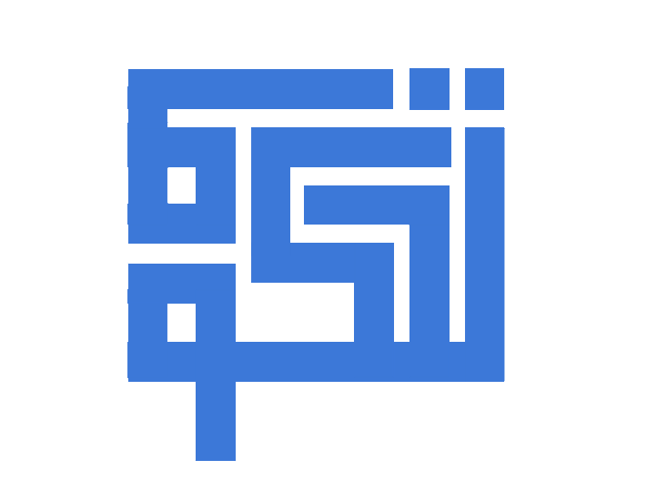

<h4 align="center">Control your Tello Ryze from your computer !</h4>

## About

I recently bought a drone to my father, for his birthday. Little did he know, the gift was for me !

I started building this for fun on my free time, because I wanted to learn about socket programming. If you want to do so as well, you can head over to `doxygen/` and compile the documentation. It might help you, if you want to get started.
If you just want to use the program, you can ! Please make sure to have a Tello Ryze, because I only tested with this drone. It might work with other Tello drones, but I can't be sure about that.


## Features

- can interact with a Tello Ryze, through its private API, and the use of DGRAM sockets
- minimalistic debug mode, and log file handler.
- sends commands in real time.
- supports multiple Ryze APIs (SDK version 1.0 and 2.0)

## In the works

- a unique DSL to script drone behaviour
- better UI
- multi-threading support

## How do I use it ?

To compile the program, you will first need to `clone` the repository, and compile the project:
```bash
git clone https://github.com/bogdzn/tahkum && cd tahkum/app && make
```

You can then type `./tahkum -h` to check the available options for the program and how to use it.
You can also check the documentation, doing `make doc` and, opening `./doxygen/build/html/index.html` with your favorite browser.
